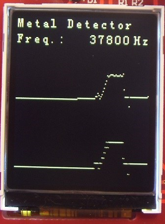

# PIC16F18446 Sensor Board Metal Detector

The PIC16F184xx family has a new Analog to Digital Converter with Computation (ADCC) with a 12-bit resolution. This project shows the reading of a metal detector using the ADCC.

In this example we will be using the PIC16F18446 Sensor Board. Initially, the board scans the metal detector LC circuit in order to find the peak (resonant) frequency. It then supplies a signal with that frequency using the NCO, and reads the ADCC. If a metal object approaches, it shifts the resonant frequency, and the ADCC value changes. The demo has 2 operating modes. In the first mode, the 12-bit and 10-bit values are plotted in real time.

When entering this mode, the first ADCC reading is used as an offset for the plots. The LCD backlight turns OFF after some time of inactivity, and turns back ON when the user presses a button. In the second mode, the buzzer is beeping at a variable time interval, according to the metal detector reading.

## Related Documentation
- [PIC16F18446 Product Family Page](https://www.microchip.com/design-centers/8-bit/pic-mcus/device-selection/pic16f18446)
- [PIC16F18446 datasheet](http://ww1.microchip.com/downloads/en/DeviceDoc/40001985B.pdf) for more information or specifications.

## Software Used
- MPLAB® X IDE 5.30 or newer [(microchip.com/mplab/mplab-x-ide)](http://www.microchip.com/mplab/mplab-x-ide)
- MPLAB® XC8 2.10 or a newer compiler [(microchip.com/mplab/compilers)](http://www.microchip.com/mplab/compilers)
- MPLAB® Code Configurator (MCC) 3.95.0 or newer [(microchip.com/mplab/mplab-code-configurator)](https://www.microchip.com/mplab/mplab-code-configurator)
- MPLAB® Code Configurator (MCC) Device Libraries 8-bit AVR MCUs 2.3.0 or newer [(microchip.com/mplab/mplab-code-configurator)](https://www.microchip.com/mplab/mplab-code-configurator)
- PIC16F1xxxx DFP 1.2.99 or newer Device Pack

## Hardware Used
- [PIC16F18446 Sensor Board Demonstration](https://www.microchip.com/promo/pic16f18446-sensor-board-demonstration)

## Setup

### MCC Settings
Here are the settings used for MSSP, CLC, NCO, FVR, ADCC, CCP, CWG, and TMR. MSSP + CLC are used for the LCD control.

### MSSP Settings
 

### CLC Settings

 

 

### NCO Settings
The NCO is used to oscillate the LC circuit.
 

### FVR Settings
FVR is used as positive reference for the ADCC, to get higher accuracy and gain.
 

### ADCC settings
 
ADRPT register is set to 0x40, to average a burst of 64 samples.
 

### CCP Settings
CCP1 is used for generating the buzzer tone.
 

### CWG Settings
CWG is used to output the signal from CCP1 in antiphase on 2 pins, so that the buzzer sounds louder.
 

### TMR Settings
TMR1 is used to clock the CCP1. It sets the pitch of the buzzer tone.  
 
TMR3 is used to set the beep interval.  
 

## Demo

 